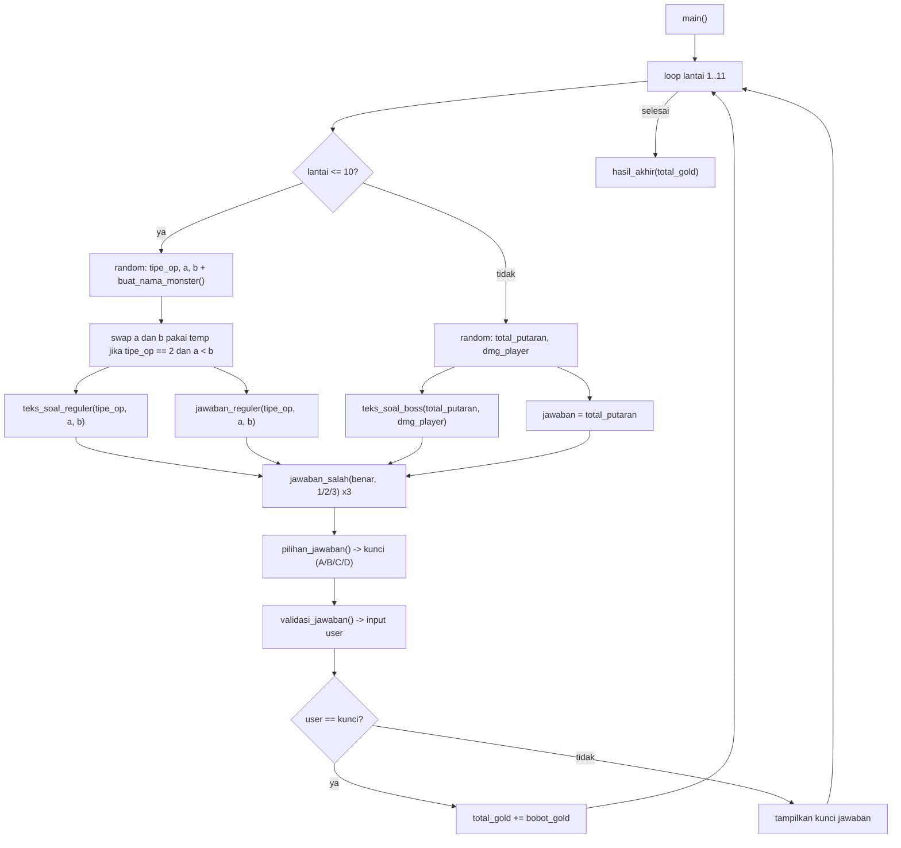

# Panduan Belajar `main.py` — Tower of MATH1011 (Versi Final Tanpa Koleksi)

Target: lo bisa **paham luar dalam tiap baris logika**, **jelasin ke dosen tanpa ragu**, dan **ngoding ulang dari file kosong**.

---

## 0. Peta Besar Alur Game

Program ini adalah game CLI quiz 11 lantai berkonsep RPG:
- **Lantai 1–10:** Soal aritmatika acak (`+`, `-`, `*`, `//`), bobot 10 Gold per soal benar (Maks 100 Gold).
- **Lantai 11:** Final Boss **SANGAR PhD** (Kalkulasi putaran RPG: `hp_boss = total_putaran * dmg_player`, `jawaban = total_putaran`), bobot 911 Gold.
- **Hasil Akhir:** Rekapitulasi perolehan Gold (Maksimal 1011 Gold).

---

## 1. Prinsip Utama: Arsitektur Skalar (Tanpa List, Dict, Set, Tuple)

Sesuai batasan materi kuliah Week 1–7:

| Yang Dihindari | Kenapa Dilarang | Solusi di Kode Ini |
|---|---|---|
| `return a, b, c` | Python otomatis membungkusnya jadi **tuple** | Pecah fungsi; masing-masing hanya `return` 1 nilai skalar |
| `a, b = b, a` | Ruas kanan `b, a` membentuk tuple sebelum di-unpack | Gunakan variabel penampung: `temp = a; a = b; b = temp` |
| Koleksi `[A, B, C, D]` | Struktur data `list` belum diajarkan | Percabangan `if-elif-else` murni berdasarkan angka acak posisi (1–4) |
| Random di dalam fungsi lalu return banyak | Nilai acak bisa inkonsisten antara soal & kunci | Angka di-random **sekali di `main()`**, lalu dioper sebagai parameter |

---

## 2. Bedah Logika per Fungsi (Urutan Kode `main.py`)

### 2.1 `buat_nama_monster()` — [UTS-PAP-KELOMPOK-9/main.py:L9-40](file:///home/lemong/Projects/UTS_PAP/UTS-PAP-KELOMPOK-9/main.py#L9-40)
- Mengacak nama anggota (1–6) dan materi matematika (1–6).
- Menggabungkan 2 string menjadi 1 string nama monster (contoh: `"Christoph Limit"`).
- Total variasi: 6 × 6 = 36 kombinasi monster unik.

### 2.2 `teks_soal_reguler(tipe_op, a, b)` — [UTS-PAP-KELOMPOK-9/main.py:L42-51](file:///home/lemong/Projects/UTS_PAP/UTS-PAP-KELOMPOK-9/main.py#L42-51)
- Menghasilkan teks soal berupa string.
- Untuk pembagian, teks soal dibentuk dari `f"{a * b} / {b} = ?"` sehingga angka yang dibagi selalu kelipatan pas.

### 2.3 `jawaban_reguler(tipe_op, a, b)` — [UTS-PAP-KELOMPOK-9/main.py:L53-63](file:///home/lemong/Projects/UTS_PAP/UTS-PAP-KELOMPOK-9/main.py#L53-63)
- Menghitung kunci jawaban integer yang tepat.
- Untuk pembagian, menggunakan operator pembagian bulat `(a * b) // b` sesuai silabus.

### 2.4 `teks_soal_boss(total_putaran, dmg_player)` — [UTS-PAP-KELOMPOK-9/main.py:L65-75](file:///home/lemong/Projects/UTS_PAP/UTS-PAP-KELOMPOK-9/main.py#L65-75)
- Menyusun teks soal cerita pertarungan Final Boss di Lantai 11:
  - `hp_boss = total_putaran * dmg_player`
  - Soal menanyakan berapa putaran yang dibutuhkan untuk menghabisi HP Boss sampai 0.

### 2.5 `jawaban_salah(jawaban_benar, urutan)` — [UTS-PAP-KELOMPOK-9/main.py:L77-87](file:///home/lemong/Projects/UTS_PAP/UTS-PAP-KELOMPOK-9/main.py#L77-87)
- Membangkitkan distraktor skalar tanpa tabrakan:
  - `urutan == 1`: `jawaban_benar + random(1, 4)`
  - `urutan == 2`: `jawaban_benar - random(1, 4)` (jika $\le 0$, diganti `jawaban_benar + random(9, 12)`)
  - `urutan == 3`: `jawaban_benar + random(5, 8)`
- Rentang tidak overlap sehingga ketiga pilihan salah dan kunci jawaban selalu 4 angka berbeda.

### 2.6 `pilihan_jawaban(posisi_benar, benar, s1, s2, s3)` — [UTS-PAP-KELOMPOK-9/main.py:L89-116](file:///home/lemong/Projects/UTS_PAP/UTS-PAP-KELOMPOK-9/main.py#L89-116)
- Menerima posisi acak (1–4) dan mencetak opsi A, B, C, D menggunakan `if-elif-else`.
- Mengembalikan string huruf kunci (`"A"`, `"B"`, `"C"`, atau `"D"`).

### 2.7 `validasi_jawaban(prompt_teks)` — [UTS-PAP-KELOMPOK-9/main.py:L118-126](file:///home/lemong/Projects/UTS_PAP/UTS-PAP-KELOMPOK-9/main.py#L118-L126)
- Menerapkan `.strip().upper()` untuk sanitasi string.
- Perulangan `while (jawaban != "A" and jawaban != "B" and jawaban != "C" and jawaban != "D"):` menolak input selain 4 huruf tersebut tanpa crash.

### 2.8 `hasil_akhir(total_gold)` — [UTS-PAP-KELOMPOK-9/main.py:L126-161](file:///home/lemong/Projects/UTS_PAP/UTS-PAP-KELOMPOK-9/main.py#L126-161)
- Evaluasi skor berurutan dari tertinggi:
  - `1011`: Penakluk Super Sangar
  - `>= 911`: Penakluk Sangar
  - `>= 10`: Kurang Sangar
  - `< 10`: Tidak Sangar
- Menggunakan variabel teks skalar (`pesan1`, `pesan2`, `pesan3`) dan mencetak baris berikutnya dengan indentasi 30 spasi jika string tidak kosong.

### 2.9 `main()` — [UTS-PAP-KELOMPOK-9/main.py:L164-243](file:///home/lemong/Projects/UTS_PAP/UTS-PAP-KELOMPOK-9/main.py#L164-243)
- Mengatur variabel akumulator `total_gold = 0`.
- Loop 11 lantai (`for lantai in range(1, TOTAL_LANTAI + 1)`).
- Menghubungkan seluruh modul secara terstruktur.

---

## 3. Latihan Bertahap: Cara Belajar Mandiri

1. **Level 1 — Tracing Manual (di Kertas):** Coba jalankan skenario acak di atas kertas: misal `tipe_op=4, a=6, b=3`. Hitung apa yang dicetak `teks_soal_reguler` dan apa yang dikembalikan `jawaban_reguler`.
2. **Level 2 — Pasang Seed Acak:** Tambahkan `random.seed(42)` di baris teratas `main.py` sementara waktu agar hasil angka selalu sama tiap kali di-run.
3. **Level 3 — Rebuild dari File Kosong:** Buka file baru kosong `rebuild.py`. Tulis fungsi satu per satu dari `buat_nama_monster` sampai `main` tanpa melihat `main.py`. Jika macet, intip 1 fungsi saja lalu tutup lagi.

---

## 4. Antisipasi Pertanyaan Dosen & Tips Menjawab

1. **"Kenapa program ini tidak memakai list sama sekali?"**
   > *Jawab:* Sesuai batasan materi silabus Week 1–7 (Dasar hingga Functions). Struktur data koleksi (`list`, `dict`, `set`, `tuple`) digantikan oleh variabel skalar dan percabangan `if-elif-else`.

2. **"Kenapa di Python menukar nilai pakai `temp`, bukan `a, b = b, a`?"**
   > *Jawab:* Di Python, sintaks `b, a` secara internal membentuk sebuah `tuple` sebelum di-*unpack*. Demi mematuhi batasan "tanpa tuple" secara ketat, kami menggunakan variabel perantara `temp`.

3. **"Bagaimana menjamin soal pembagian tidak menghasilkan angka desimal/koma?"**
   > *Jawab:* Soal dibentuk terbalik dari perkalian: `hasil_kali = a * b`, lalu soalnya ditampilkan sebagai `hasil_kali / b = ?` dan dihitung dengan operator pembagian bulat `hasil_kali // b`. Hasilnya selalu bilangan bulat `a`.

4. **"Bagaimana menjamin 4 pilihan ganda tidak pernah ada angka kembar?"**
   > *Jawab:* Fungsi `jawaban_salah(jawaban_benar, urutan)` membangkitkan 3 distraktor dengan rentang offset yang terpisah (tidak overlap): `+1..4`, `-1..4`, dan `+5..8`.
