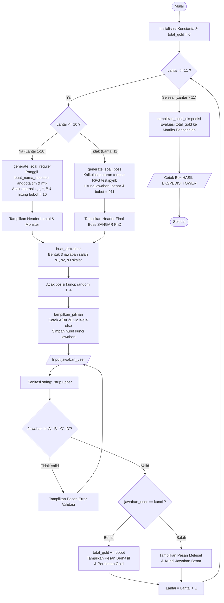

# DOKUMENTASI FLOWCHART SISTEM - TOWER OF MATH1011
**Kelompok 9 - Pengantar Algoritma dan Pemrograman (PAP)**

---

## 1. Diagram Alir Utama (Game Flowchart)

Diagram ini mengilustrasikan seluruh alur eksekusi program `main.py` dari inisialisasi hingga kalkulasi hasil akhir.

---

## 2. Penjelasan Komponen Alur (Traceability ke Task Tim)

| Simbol / Tahapan | Fungsi / Modul Terkait | Penanggung Jawab Task |
| :--- | :--- | :--- |
| **Generator Soal Reguler (Lantai 1-10)** | `generate_soal_reguler()` | **Task 1: Wilbert Owen Nathanael** |
| **Validasi & Sanitasi Input Jawaban** | `validasi_input_jawaban()` | **Task 2: Christoph Jordan Dalimartin** |
| **Distraktor & Tampilan Opsi A/B/C/D** | `buat_distraktor()`, `tampilkan_pilihan()` | **Task 3: Lionel Esra Mailuhu** |
| **Generator Final Boss (Lantai 11)** | `generate_soal_boss()` | **Task 4: Joel Sebastian Lasmito** |
| **Rekapitulasi Akhir & Matriks Gold** | `tampilkan_hasil_ekspedisi()` | **Task 5: Evan Adhiarja Yohanes** |
| **Generator Nama Monster & Game Loop** | `buat_nama_monster()`, `main()` | **Task 6: Yosia Edmund Herlianto** |
