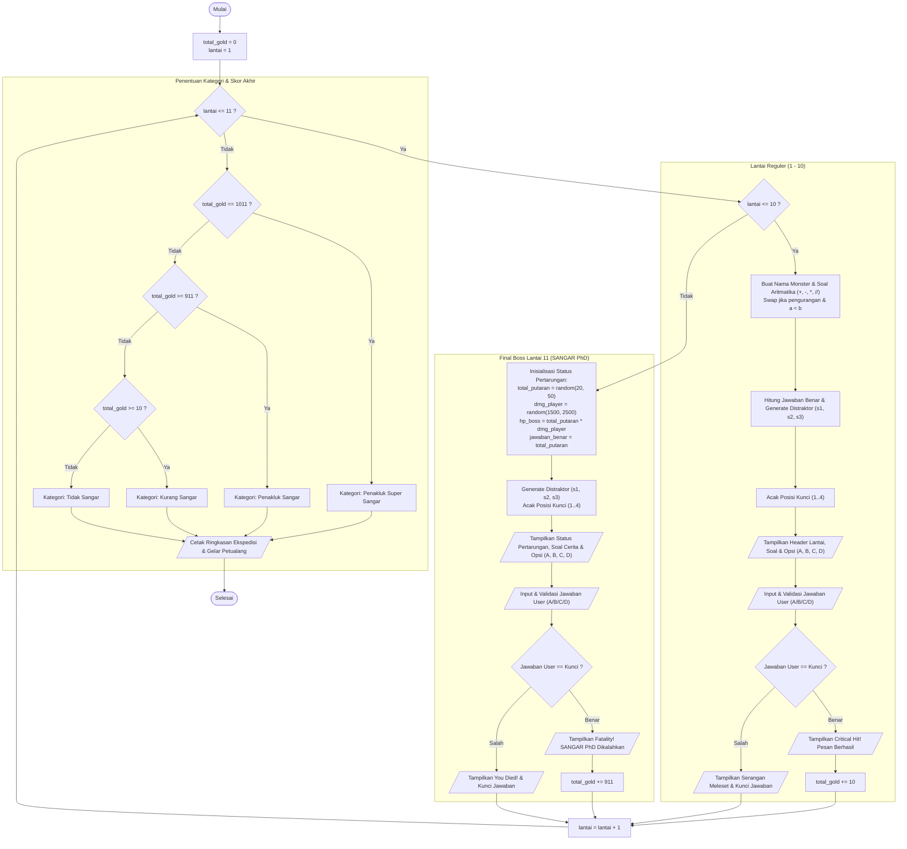

# Dokumentasi Flowchart Sistem - Tower of MATH1011
**Kelompok 9 | Pengantar Algoritma dan Pemrograman (PAP)**

---

## Diagram Alir Utama (Game Flowchart)

Diagram alir berikut memetakan logika eksekusi program `main.py` dari awal hingga selesai, mencakup lantai reguler (1–10), simulasi pertarungan Final Boss (Lantai 11), dan modul rekapitulasi akhir:

